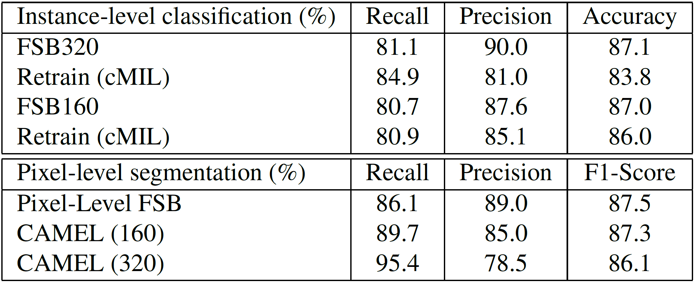

## Paper Information
#### Paper Title: [CAMEL: A Weakly Supervised Learning Framework for Histopathology Image Segmentation](https://arxiv.org/pdf/1908.10555.pdf)

#### Conference: ICCV 2019

#### Network Structure

## Short Summary
The paper introduces a new framework called CAMEL for WSSS. It consists of two steps:

1. Label Enrichment
The WSI is divided into instances (or patches) which are then classified by the network. This can be regarded as a weakly supervised classification problem.

2. Segmentation
These instance-level labels are then used as approximate pixel-level labels to perform a pixel-wise segmentation under full supervision with [DeepLabv2](https://github.com/google-research/deeplab2).
This can be regarded as self-supervised approach.

The authors state that CAMEL achieves comparable performance with fully-supervised approaches in both tasks: instance-level classification and pixel-level segmentation.

## Three questions about this paper:

### 1. [Motivation] What problem is this paper trying to solve?
It tackles the problem of semantic segmentation using binary image-level labels of WSI patches

### 2. [Method] How does this paper solve the above problems?
A new method for binary instance-level classification called combined MIL (cMIL) is proposed.

**CAMEL Network**:

**1. Label enrichment**:
- Combined MIL (cMIL):
   - Two different MIL-based instance classifiers are trained separately. Each has a different patch-selection criteria to guide the weight update. The selected patch is regarded as the WSI prediction to train both networks in a supervised manner using cross-entropy loss.
   - After training the same WSIs are fed into the network again and labels are generated for selected instances (using the same patch-selection criteria as during training)
 - Retrain:
   - These labelled instances are used to retrain a new classifier in a supervised manner
   - Additionally, unlabelled instances are used for training by simply assigning them the image-level label
 - Relabel:
   - The trained classifier is used to classify all instances of the WSIs

**2. Segmentation**
- Instance-level labels are directly assigned to corresponding pixels
- Fully-supervised model is trained using DeepLabV2 (U-Net and ResNet-34)

### 3. Details about the experiment

#### 3.1 Which Datasets are used?
- Image type: H&E stained WSIs, lymph node metastasis (CAMELYON16)
- Image number: 400 (159 CA, 241 NC)
- Train/Val/Test: 240 (110 CA, 130 NC) / 160 (49 CA, 111 NC)
  - Split into smaller patches for training (5011 CA, 96496 NC) and CA is oversampled to match NC
- Image size: 1280 x 1280, but randomly cropped to 640 x 640 for training segmentation model (DeepLabv2, U-Net)
- Resolution: 0.5 microns/pixel at 20x magnification

To evaluate the generality of CAMEL, tests are performed on a second, private WSI dataset of colorectal adenoma.

#### 3.2 What are the implementation details?
- Hardware: 4 GTX 1080Ti GPUs
- Data augmentation: Rotation, Mirroring, Scaling (between 1.0x and 1.2x)
- Optimizer: Adam with 1e-4 learning rate for cMil and retrain step, 1e-3 learning rate for segmentation with DeepLabv2
- Batch size: 4 per GPU in cMil, 10 per GPU in retrain step, 6 per GPU in segmentation

#### 3.3 What's the evaluation metric?
- Sensitivity 
- Specificity
- Accuracy
- F1-Score
- IoU

#### 3.4 What is the ranking of the experiment results?
Comparison with other WSSS methods on the CAMELYON16 test set. WILDCAT, however, was developed for natural images:

Evaluation of generalization ability of CAMEL to colorectal adenoma dataset:

