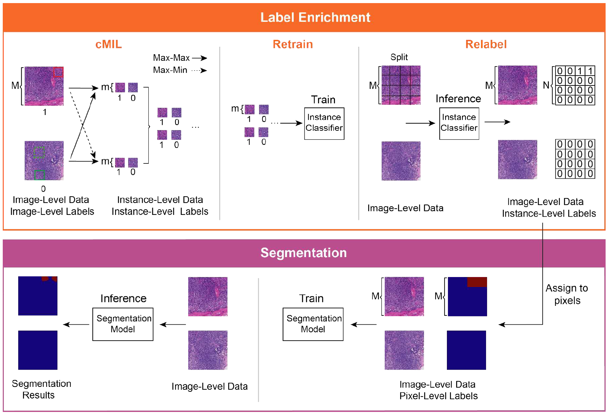

## Paper Information
#### Paper Title: [CAMEL: A Weakly Supervised Learning Framework for Histopathology Image Segmentation](https://arxiv.org/pdf/1908.10555.pdf)

#### Conference: ICCV 2019

#### Network Structure

## Short Summary
The paper introduces a new framework called CAMEL for WSSS. It consists of two steps:

1. Label Enrichment
The WSI is divided into instances (or patches) which are then classified by the network. This can be regarded as a weakly supervised classification problem.

2. Segmentation
These instance-level labels are then used as approximate pixel-level labels to perform a pixel-wise segmentation under full supervision with [DeepLabv2](https://github.com/google-research/deeplab2).
This can be regarded as self-supervised approach.

The authors state that CAMEL achieves comparable performance with fully-supervised approaches in both tasks: instance-level classification and pixel-level segmentation.

## Five questions about this paper:

### 1. [Motivation] What problem is this paper trying to solve?
It tackles the problem of semantic segmentation using binary image-level labels of WSI-patches

### 2. [Method] How does this paper solve the above problems?
A new method for binary instance-level classification called combined MIL (cMIL) is proposed.

**CAMEL Network**:

**1. Label enrichment**:
- Combined MIL (cMIL):
   - Two different MIL-based instance classifiers are trained separately. Each has a different patch-selection criteria to guide the weight update. The selected patch is regarded as the WSI prediction to train both networks in a supervised manner using cross-entropy loss.
   - After training the same WSIs are fed into the network again and labels are generated for selected instances (using the same patch-selection criteria as during training)
 - Retrain:
   - These labelled instances are used to retrain a new classifier in a supervised manner
   - Additionally, unlabelled instances are used for training by simply assigning them the image-level label
 - Relabel:
   - The trained classifier is used to classify all instances of the WSIs

**2. Segmentation**
- Instance-level labels are directly assigned to corresponding pixels
- Fully-supervised model is trained using DeepLabV2 (U-Net and ResNet-34)

### 3. Details about the experiment

#### 3.1 Which Datasets are used?
1. CAMELYON16

400 H&E stained WSIs of lymph node sections at 20x magnification (approx. 0.5 microns/pixel) are utilized.
The WSIs are split into 1280 x 1280 patches for training (96k non-cancer and 5k cancer). The cancer patches are oversampled.

2. Colorectal Adenoma Dataset (private)
To evaluate the generality of CAMEL, tests are performed on a second WSI dataset of colorectal adenoma.
CAMEL manages to generalize well to other cancer types.

#### 3.2 What's the evaluation metric?
- Sensitivity 
- Specificity
- Accuracy
- F1-Score
- IoU

#### 3.3 Ablation Study
No ablation study was performed

#### 3.4 What is the ranking of the experiment results?
Comparision with other WSSS methods:

WILDCAT, however, was developed for natural images.

### 4. Advantages (self-summary rather than the author's)
Reaches a comparable performance to the fully-supervised baseline with pixel-level annotations.
This indicates that the instance-level classifciations performed in the label enrichment step are of good quality and that the segmentation CNN is able to refine them.

### 5. Disadvantages (self-summary rather than the author's)
Needs image labels for 1280 x 1280 patches and cannot perform on WSI image labels.