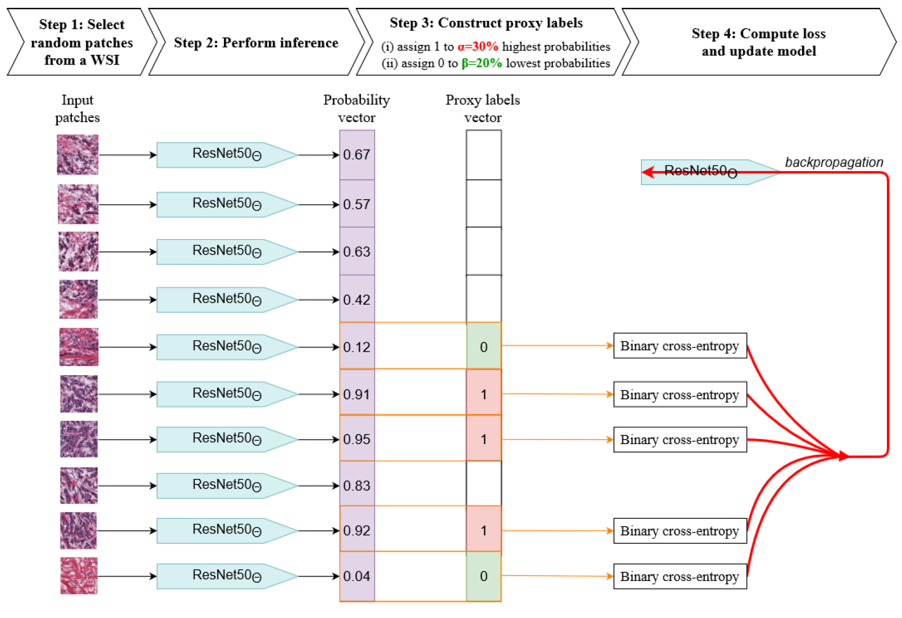
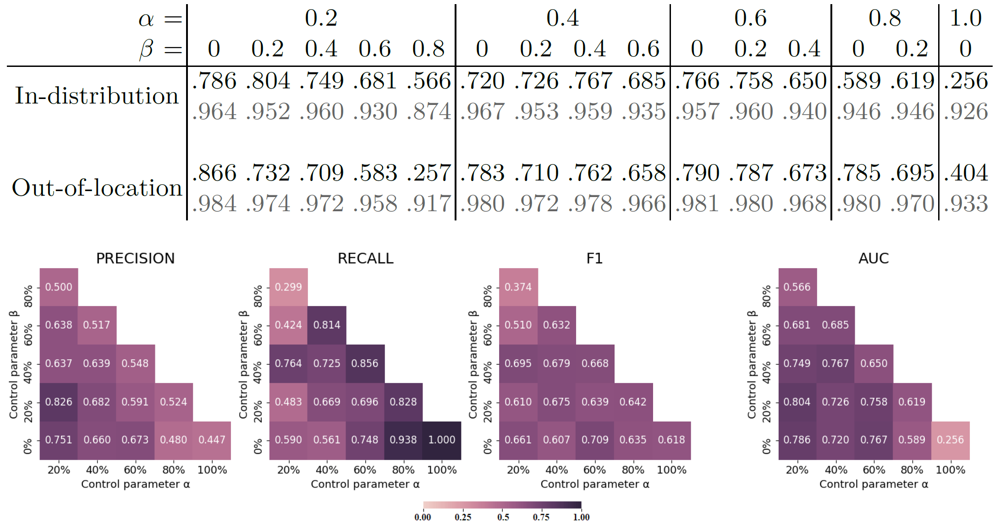

## Paper Information
#### Paper Title: [Weakly supervised multiple instance learning histopathological tumor segmentation](https://arxiv.org/abs/2004.05024)

#### Conference: MICCAI 2020

#### Official Code: https://github.com/marvinler/tcga_segmentation

#### Network Structure

## Short Summary
Within this paper a patch-based segmentation algorithm is proposed based on binary image-level labels of WSIs.
MIL is applied to train an instance classifier model. Therefore, a WSI is divided into equally-sized patches (224 x 224) which are interpreted as instances.

## Five questions about this paper:

### 1. [Problem Definition] What problem is this paper trying to solve? 
It tackles the problem of WSI segmentation using only binary image-level labels of WSI patches

### 2. [Method] How does this paper solve the above problems?
It trains a binary patch classifier (ResNet50) which is then used to perform a segmentation of the gigapixel WSI.
To train this model, a new method is proposed which enables to utilize patches with uncertain labels. 
This includes all patches from WSIs which are labelled to have cancerous tissue, since the extracted patches could also contain no cancerous tissue.
During training, a single forward pass batch contains only a subsample of 150 images from a WSI. 
Label 1 (= cancerous) is assigned to 20% (= alpha) of the patches for which the network yields the highest probability.
Label 0 (= non-cancerous) is assigned to 20% (= beta) of the patches for which for which the network yields the lowest probability.
Only these patches are then used to update the weights. The rest is discarded.

### 3. Details about the experiment

#### 3.1 Which Datasets are used?
6481 flash-frozen WSIs of kidney, lung, and breast at 20x magnification from the TCGA dataset were used.
From these, 4212, 972, and 1296 images were used for training, validation, and testing, respectively.
130 of the test images were annotated on pixel-level for a better performance assesment. 

To measure out-of-distribution performance, the model was evaluated on additional 100 slides extracted from locations that were not used during training (colon, ovary, corpus uteri).
Additionally, the model was evaluated on the PatchCamelyon dataset, which contains formalin-fixed, parafin-embedded (FFPE) tissues. These are visually different from flash-frozen ones.
#### 3.2 How is the experiment set up?
15 ResNet50 networks with different configurations for alpha and beta were trained and compared with eachother on the test sets mentioned above.

#### 3.3 What's the evaluation metric?
- Precision
- Recall
- F1-Score
- AUC

#### 3.4 What is the ranking of the experiment results?
No comparision with other methods was performed. 
The following table shows the AUC values for different configurations. 
Grey results take background into account.

Performance on PatchCamelyon is not included in the table above and achieved the optimal AUC of 0.802 for alpha = 20% and beta = 20%.