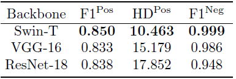
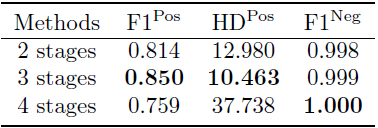
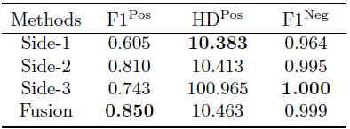
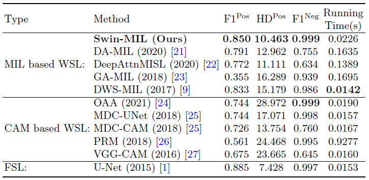

## Paper Information
#### Paper Title: Transformer based multiple instance learning for weakly supervised histopathology image segmentation

#### Conference: MICCAI 2022

#### Official Code: https://github.com/Nexuslkl/Swin_MIL

#### Network Structure

## Short Summary
The Swin transformer is incorporated into the MIL framework to encode long-range relationships between instances within a bag.
It employs so-called deep supervision, meaning additional "companion" objective functions at different hidden layers (here: after each transformer stage) are introduced. The final loss is then computed from the output loss plus the companion losses.
A decoder produces pixel-wise predictions using the feature maps after each stage of the transformer. A fusion layer is employed to combine these side-outputs of different scales to produce the final segmentation map.

## Three questions about this paper:

### 1. [Problem Definition] What problem is this paper trying to solve? 
It tackles the problem of WSI patch segmentation using only binary image-level labels of WSIs

### 2. [Method] What's new in this paper?
It's the first method performing a weakly-supervised segmentation using a combination of Transformer and MIL, which enables to produce features that encode long-distance relationships between instances. Usually instances of a bag are independent of eachother in MIL.

### 3. Details about the experiment

#### 3.1 Which Datasets are used?
- Image type: H&E stained, colon cancer (private)
- Image number: 910 (330 CA, 580 NC)
- Train/Val/Test: 750 (250 CA, 500 NC) / 160 (80 CA, 80 NC)
- Image size: 3000 x 3000, but downsampled to 256 x 256 for training
- Resolution: 0.226 microns/pixel at 40x magnification

#### 3.2 What are the implementation details?
- Hardware: Multiple RTX 3090 with 24GB memory
- Initialization: Pretrained on ImageNet, Xavier for side-output layers
- Optimizer: Adam with 1e-6 learning rate, 1e-9 learning rate for side outputs
- Batch size: 4 per GPU

#### 3.3 What's the evaluation metric?
- F1-Score
- Hausdorff Distance

#### 3.4 Ablation Study
1. Effect of different backbone\
   
2. Effects of number of stages in backbone\
   
3. Effect of side-outputs and fusion\
   

#### 3.5 What is the ranking of the experiment results?
It outperforms other state-of-the-art WSSS methods:\
