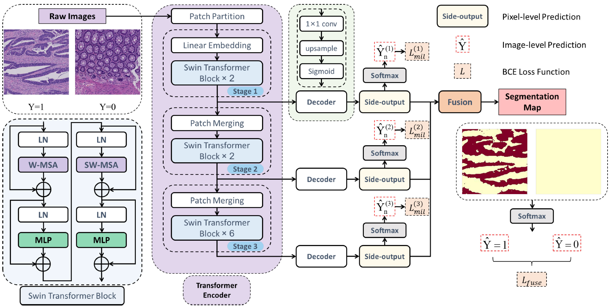

## Paper Information
#### Paper Title: Transformer based multiple instance learning for weakly supervised histopathology image segmentation

#### Conference: MICCAI 2022

#### Official Code: https://github.com/Nexuslkl/Swin_MIL

#### Network Structure

## Short Summary

## Five questions about this paper:

### 1. [Problem Definition / Motivation] What problem is this paper trying to solve? 

### 2. [Contribution / Method] What's new in this paper? / How does this paper solve the above problems?

### 3. Details about the experiment

#### 3.1 Which Datasets are used?

#### 3.2 How is the experiment set up?

#### 3.3 What's the evaluation metric?

#### 3.4 Ablation Study

#### 3.5 What is the ranking of the experiment results?

### 4. Advantages (self-summary rather than the author's)

### 5. Disadvantages (self-summary rather than the author's)